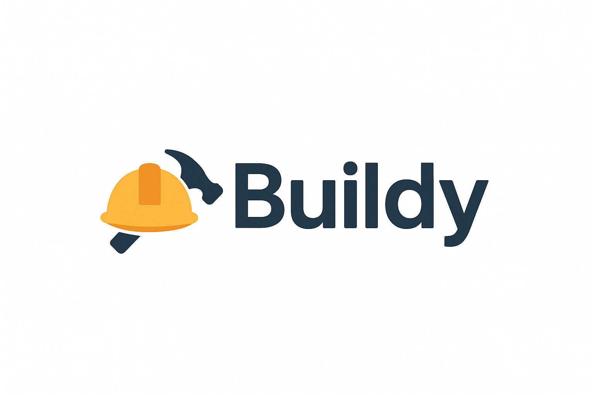

# 🏗️ Buildy Platform Documentation

Welcome to the **Buildy Docs** — your single source of truth for running, monitoring, and scaling Buildy.  
This documentation covers everything from **day-to-day operations** to **dashboards and APIs**.

---

## 🚀 What is Buildy?

Buildy is a modern platform for:
- Streamlined deployments  
- Automated runbooks  
- Real-time monitoring & dashboards  
- Business & technical KPIs  

👉 Designed for **engineering teams**, **DevOps**, and **business stakeholders**.

---

## 📚 Documentation Structure

### 🔧 [Runbooks](runbooks.md)
Step-by-step guides for:
- Incident response  
- Service restarts  
- Scaling infrastructure  
- Database recovery  

👉 Helps teams resolve issues **quickly and consistently**.

---

### 📊 [Dashboards](dashboards.md)
Pre-built and custom dashboards for:
- **System health** (CPU, memory, uptime)  
- **API & network monitoring**  
- **Business KPIs** (users, churn, revenue)  

👉 A **single pane of glass** for both technical and business visibility.

---

### 🔌 [API Reference](api.md)
Comprehensive reference for Buildy’s REST API:
- Authentication  
- Endpoints & request examples  
- Response formats  
- Error codes  

👉 Integrate Buildy data into your own tools.

---

## 🎨 Branding

Buildy’s docs are customized with:
- **Logo:** { width=120px }  
- **Favicon:** { width=20px }  
- **Colors:** purple + gold theme for a clean, professional look.

---

## ✅ Next Steps

- Start with a **[Runbook](runbooks.md)** for quick hands-on use.  
- Explore **[Dashboards](dashboards.md)** for monitoring.  
- Dive into the **[API](api.md)** to automate workflows.  

---

📌 *This documentation is a living resource. Keep it updated as your platform evolves.*  

